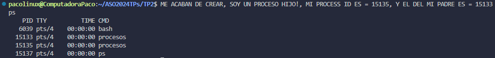

# **_Arquitectura Sistemas Operativos_**
## _Paco Fontana_

### 📑 Indice
- <a href="#tp1">Trabajo Practico N°1</a>
- <a href="#tp2">Trabajo Practico N°2</a>

<a name="tp2"></a>
# 
### 📚 Trabajo Practico N°2
#### 📖 `Uso de "GCC" y "GitHub"`
##### 📃 En este trabajo aplicamos funciones de **gcc** y **github**, usando repositorios y mas.

##### En el codigo usado, podemos ver un ejemplo de como usar la funcion `fork()`, creando asi dos procesos iguale diferenciados en "Padre" e "Hijo"


#### Codigo que usamos:
```
#include <unistd.h>
#include <sys/types.h>
#include <stdio.h>
#include <sys/wait.h>


int main( ){
   pid_t child_pid;

   child_pid = fork (); //Crea nuevo proceso hijo

   if (child_pid < 0) {
      printf("FALLÓ EL FORK! ");

      return 1;
   } else if (child_pid == 0) {
      printf ("ME ACABAN DE CREAR, SOY UN PROCESO HIJO!, MI PROCESS ID ES = %d, Y EL DEL MI PADRE ES = %d\n", getpid(), getppid( ));
   } else {
      wait(NULL); //Bloquea al padre hasta que todos los hijos finalicen

      printf ("SOY EL PROCESO PADRE! ");
      printf ("MI PROCESS ID ES = %d, Y EL DE MI PADRE = %d, Y EL DEL HIJO RECIEN CREADO = %d\n", getpid( ), getppid( ), child_pid);
   }


sleep(10);

return 0;
}