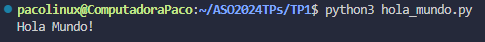

# **_Arquitectura Sistemas Operativos_**
## _Paco Fontana_

### 📑 Indice
- <a href="#tp1">Trabajo Practico N°1</a>
- <a href="#tp2">Trabajo Practico N°2</a>

#
<a name="tp1"></a>
### 📚 Trabajo Practico N°1
#### 📖 `Instalacion "Visual Studio Code" y prueba de su uso`
##### 📃 Instalamos **Visual Studio Code** junto algunas extensiones como **WSL**, **Ubuntu**, etc

##### Para hacer una prueba de como funciona, usamos un codigo simple de `Python` que muestra en consola `Hola Mundo!` usando `python3 hola_mundo.py` _(haciendo referencia al nombre que le di al archivo)_


#### Codigo usado:
```
Print("Hola Mundo!")
```

<a name="tp2"></a>
# 
### 📚 Trabajo Practico N°2
#### 📖 `Uso de "GCC" y "GitHub"`
##### 📃 En este trabajo aplicamos funciones de **gcc** y **github**, usando repositorios y mas.

##### En el codigo usado, podemos ver un ejemplo de como usar la funcion `fork()`, creando asi dos procesos iguale diferenciados en "Padre" e "Hijo"


#### Codigo usado:
```
#include <unistd.h>
#include <sys/types.h>
#include <stdio.h>
#include <sys/wait.h>


int main( ){
   pid_t child_pid;

   child_pid = fork (); //Crea nuevo proceso hijo

   if (child_pid < 0) {
      printf("FALLÓ EL FORK! ");

      return 1;
   } else if (child_pid == 0) {
      printf ("ME ACABAN DE CREAR, SOY UN PROCESO HIJO!, MI PROCESS ID ES = %d, Y EL DEL MI PADRE ES = %d\n", getpid(), getppid( ));
   } else {
      wait(NULL); //Bloquea al padre hasta que todos los hijos finalicen

      printf ("SOY EL PROCESO PADRE! ");
      printf ("MI PROCESS ID ES = %d, Y EL DE MI PADRE = %d, Y EL DEL HIJO RECIEN CREADO = %d\n", getpid( ), getppid( ), child_pid);
   }


sleep(10);

return 0;
}
```
#

<p align="center">
<small>Tecnicatura en Programacion (2024) - UTN</small>
</p>
<p align="center">
<small>Paco Fontana</small>
</p>

<div style="background-color: #007ACC; color: white; padding: 20px;">
  <h3>📚 Trabajo Practico N°1</h3>
  <h4>📖 Instalacion "Visual Studio Code" y prueba de su uso</h4>
  <h5>📃 Instalamos <strong>Visual Studio Code</strong> junto algunas extensiones como <strong>WSL</strong>, <strong>Ubuntu</strong>, etc</h5>
  <p>Para hacer una prueba de como funciona, usamos un codigo simple de <code>Python</code> que muestra en consola <code>Hola Mundo!</code> usando <code>python3 hola_mundo.py</code> (haciendo referencia al nombre que le di al archivo).</p>
  
  <h4>Codigo usado:</h4>
  <pre><code>print("Hola Mundo!")</code></pre>
</div>

# 
<div style="background-color: #FFA500; color: black; padding: 20px;">
  <h3>📚 Trabajo Practico N°2</h3>
  <h4>📖 Uso de "GCC" y "GitHub"</h4>
  <h5>📃 En este trabajo aplicamos funciones de <strong>gcc</strong> y <strong>github</strong>, usando repositorios y mas.</h5>
  <p>En el codigo usado, podemos ver un ejemplo de como usar la funcion <code>fork()</code>, creando asi dos procesos iguales diferenciados en "Padre" e "Hijo"</p>
  
  <h4>Codigo usado:</h4>
  <pre><code>#include &lt;unistd.h&gt;
#include &lt;sys/types.h&gt;
#include &lt;stdio.h&gt;
#include &lt;sys/wait.h&gt;


int main( ){
   pid_t child_pid;

   child_pid = fork (); //Crea nuevo proceso hijo

   if (child_pid &lt; 0) {
      printf("FALLÓ EL FORK! ");

      return 1;
   } else if (child_pid == 0) {
      printf ("ME ACABAN DE CREAR, SOY UN PROCESO HIJO!, MI PROCESS ID ES = %d, Y EL DEL MI PADRE ES = %d\n", getpid(), getppid( ));
   } else {
      wait(NULL); //Bloquea al padre hasta que todos los hijos finalicen

      printf ("SOY EL PROCESO PADRE! ");
      printf ("MI PROCESS ID ES = %d, Y EL DE MI PADRE = %d, Y EL DEL HIJO RECIEN CREADO = %d\n", getpid( ), getppid( ), child_pid);
   }


sleep(10);

return 0;
}</code></pre>
</div>
