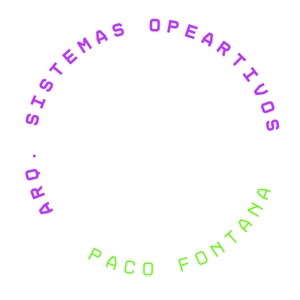

<h3 align="center"><em>Arquitectura Sistemas Operativos</em></h3>
<h2 align="center"><em>Paco Fontana</em></h2>

<h6 align="center">
</h6>

#

### 📑 Indice
- <a href="#📚-trabajo-practico-n°1"></a>
- <a href="#📚-trabajo-practico-n°2"></a>

#
<a name="tp1"></a>
### 📚 Trabajo Practico N°1
#### 📖 `Instalacion "Visual Studio Code" y prueba de su uso`
##### 📃 Instalamos **Visual Studio Code** junto algunas extensiones como **WSL**, **Ubuntu**, etc

##### Para hacer una prueba de como funciona, usamos un codigo simple de `Python` que muestra en consola `Hola Mundo!` usando `python3 hola_mundo.py` _(haciendo referencia al nombre que le di al archivo)_


#### Codigo usado:
```
Print("Hola Mundo!")
```

<a name="tp2"></a>
# 
### 📚 Trabajo Practico N°2
#### 📖 `Uso de "GCC" y "GitHub"`
##### 📃 En este trabajo aplicamos funciones de **gcc** y **github**, usando repositorios y mas.

##### En el codigo usado, podemos ver un ejemplo de como usar la funcion `fork()`, creando asi dos procesos iguale diferenciados en "Padre" e "Hijo"


#### Codigo usado:
```
#include <unistd.h>
#include <sys/types.h>
#include <stdio.h>
#include <sys/wait.h>


int main( ){
   pid_t child_pid;

   child_pid = fork (); //Crea nuevo proceso hijo

   if (child_pid < 0) {
      printf("FALLÓ EL FORK! ");

      return 1;
   } else if (child_pid == 0) {
      printf ("ME ACABAN DE CREAR, SOY UN PROCESO HIJO!, MI PROCESS ID ES = %d, Y EL DEL MI PADRE ES = %d\n", getpid(), getppid( ));
   } else {
      wait(NULL); //Bloquea al padre hasta que todos los hijos finalicen

      printf ("SOY EL PROCESO PADRE! ");
      printf ("MI PROCESS ID ES = %d, Y EL DE MI PADRE = %d, Y EL DEL HIJO RECIEN CREADO = %d\n", getpid( ), getppid( ), child_pid);
   }


sleep(10);

return 0;
}
```

#

<p align="center">
<small>Tecnicatura en Programacion (2024) - UTN</small>
</p>
<p align="center">
<small>Paco Fontana</small>
</p>