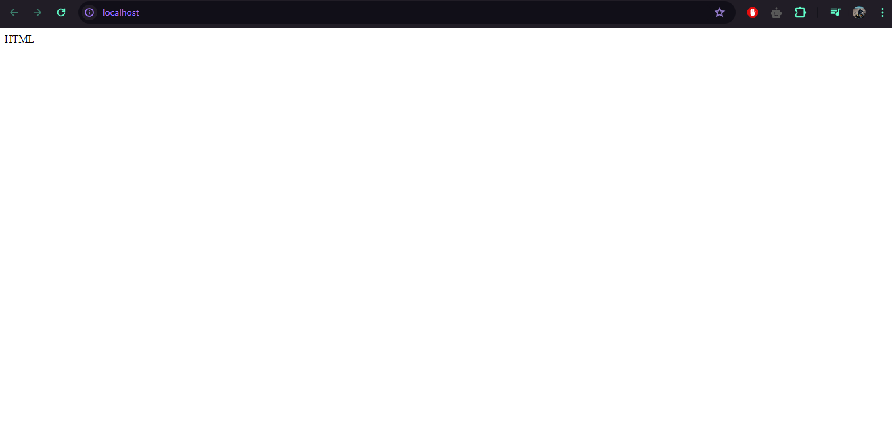

<h3 align="center"><em>Arquitectura Sistemas Operativos</em></h3>
<h2 align="center"><em>Paco Fontana</em></h2>

<h6 align="center">
</h6>

#

### 📑 Indice
- <a href="#tp1"></a>
- <a href="#tp2"></a>
- <a href="#tp3"></a>
- <a href="#tp4"></a>

#
<a name="tp1"></a>
### 📚 Trabajo Practico N°1
#### 📖 `Instalacion "Visual Studio Code" y prueba de su uso`
##### 📃 Instalamos **Visual Studio Code** junto algunas extensiones como **WSL**, **Ubuntu**, etc

##### Para hacer una prueba de como funciona, usamos un codigo simple de `Python` que muestra en consola `Hola Mundo!` usando `python3 hola_mundo.py` _(haciendo referencia al nombre que le di al archivo)_


#### Codigo usado:
```
Print("Hola Mundo!")
```

<a name="tp2"></a>
# 
### 📚 Trabajo Practico N°2
#### 📖 `Uso de "GCC" y "GitHub"`
##### 📃 En este trabajo aplicamos funciones de **gcc** y **github**, usando repositorios y mas.

##### En el codigo usado, podemos ver un ejemplo de como usar la funcion `fork()`, creando asi dos procesos iguale diferenciados en "Padre" e "Hijo"


#### Codigo usado:
```
#include <unistd.h>
#include <sys/types.h>
#include <stdio.h>
#include <sys/wait.h>


int main( ){
   pid_t child_pid;

   child_pid = fork (); //Crea nuevo proceso hijo

   if (child_pid < 0) {
      printf("FALLÓ EL FORK! ");

      return 1;
   } else if (child_pid == 0) {
      printf ("ME ACABAN DE CREAR, SOY UN PROCESO HIJO!, MI PROCESS ID ES = %d, Y EL DEL MI PADRE ES = %d\n", getpid(), getppid( ));
   } else {
      wait(NULL); //Bloquea al padre hasta que todos los hijos finalicen

      printf ("SOY EL PROCESO PADRE! ");
      printf ("MI PROCESS ID ES = %d, Y EL DE MI PADRE = %d, Y EL DEL HIJO RECIEN CREADO = %d\n", getpid( ), getppid( ), child_pid);
   }


sleep(10);

return 0;
}
```

<a name="tp3"></a>
# 
### 📚 Trabajo Practico N°3
#### 📖 `Tiempo de ejecucion de los programas`
##### 📃 En este trabajo probamos el tiempo de ejecucion entre programas con hilos y sin hilos, tambien resolvemos un problema que provoca repartir hamburgesas de manera no equitativa. 

#### 1-A: En mi caso, el archivo <a href="TP3/tareas/sinhilos.py">"sinhilos.py"</a> se ejecuta en un tiempo aproximado de 5,22.. segundos, mientras que el archivo <a href="TP3/tareas/conhilos.py">"conhilos.py"</a> dura aproximadamente 4,027.. segundos en ejecutarse por completo. Ejecutando ambos archivos (por separado) en diferentes ocasiones, cambia el tiempo el tiempo que tarda en ejecutarse por completo. <div> Por lo que podria decirse que "No son predecibles" los tiempos de ejecucion.

#### 1-B: Los tiempos de ejecucion comparados con mi compañero son similares, pero no iguales.

#### 1-C: En la primer situacion, siempre devuelve un valor final "0" porque el programa usa una misma  para acumular el valor de la suma (+5) y el valor de la resta (-5) haciendo que el valor final quede en "0", en cambio en la segunda situacion (aplicando las funciones que estaban desactivadas con las notas) al programa le toma mas  tiempo ejecutarse y devuelve un valor aleatorio cada vez que se ejecuta.

#### 2-A: Resolviendo el puzzle podemos hacer que dos comensales se turnen para comer las hamburgesas


#### Codigo usado:
```
#include <pthread.h>
#include <stdio.h>
#include <stdlib.h>
#define NUMBER_OF_THREADS 2
#define CANTIDAD_INICIAL_HAMBURGUESAS 20
int cantidad_restante_hamburguesas = CANTIDAD_INICIAL_HAMBURGUESAS;

int turno = 0;


void *comer_hamburguesa(void *tid)
{
	while (1 == 1)
	{ 
		
    // INICIO DE LA ZONA CRÍTICA
	while(turno!=(int)tid);

		if (cantidad_restante_hamburguesas > 0)
		{
			printf("Hola! soy el hilo(comensal) %d , me voy a comer una hamburguesa ! ya que todavia queda/n %d \n", (int) tid, cantidad_restante_hamburguesas);
			cantidad_restante_hamburguesas--; // me como una hamburguesa
		}
		else
		{
			printf("SE TERMINARON LAS HAMBURGUESAS :( \n");
				turno = (turno + 1)% NUMBER_OF_THREADS;
			pthread_exit(NULL); // forzar terminacion del hilo
		}

		turno = (turno + 1)% NUMBER_OF_THREADS;
    // SALIDA DE LA ZONA CRÍTICA   

	}
}

int main(int argc, char *argv[])
{
	pthread_t threads[NUMBER_OF_THREADS];
	int status, i, ret;
	for (int i = 0; i < NUMBER_OF_THREADS; i++)
	{
		printf("Hola!, soy el hilo principal. Estoy creando el hilo %d \n", i);
		status = pthread_create(&threads[i], NULL, comer_hamburguesa, (void *)i);
		if (status != 0)
		{
			printf("Algo salio mal, al crear el hilo recibi el codigo de error %d \n", status);
			exit(-1);
		}
	}

	for (i = 0; i < NUMBER_OF_THREADS; i++)
	{
		void *retval;
		ret = pthread_join(threads[i], &retval); // espero por la terminacion de los hilos que cree
	}
	pthread_exit(NULL); // como los hilos que cree ya terminaron de ejecutarse, termino yo tambien.
}
```

#### 2-B: 

<a href="https://whimsical.com/FADmh2Z9PN4nWnA62wYKwa">*Hacer clic aca para ir al diagrama original en el sitio web donde lo hice..*</a>

#

<a name="tp4"></a>
### 📚 Trabajo Practico N°4
#### 📖 `Clonar sitio web de UTN en un host local`




#

<p align="center">
<small>Tecnicatura en Programacion (2024) - UTN</small>
</p>
<p align="center">
<small>Paco Fontana</small>
</p>